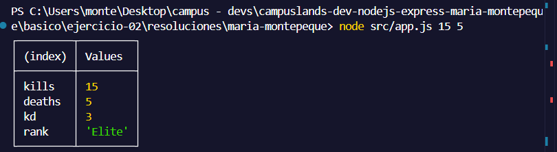
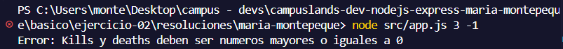

# Ejercicio 02 - npm scripts y package.json (Maria Montepeque)

## Que hace

Script Node.js con tematica de shooters competitivos, enfocado en el uso de scripts
npm y `package.json`.

- `src/app.js`: recibe kills y deaths, valida que sean numeros mayores o iguales a 0
  y calcula el ratio kd, asignando un rango (`Elite`, `Competitivo`, `Balanceado` o
  `Necesita practica`) segun el resultado.
- `src/info.js`: lee el propio `package.json` (nombre, version, scripts) y valida que
  esten definidos los scripts requeridos (`start`, `dev`, `info`), avisando si falta
  alguno.

Si kills o deaths no son numeros validos o son negativos, `app.js` lanza un error y
termina con `process.exitCode = 1`.

## Como ejecutar

```bash
npm install
npm start
npm run dev
npm run info
```

## Resultados esperados
- ```node src/app.js 15 5```


- ```node src/app.js 3 -1```
