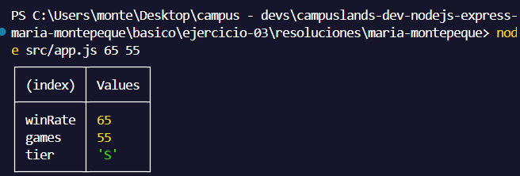
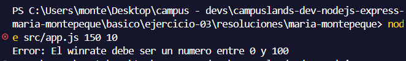

# Ejercicio 03 - modulos CommonJS (Maria Montepeque)

## Que hace

Script Node.js con tematica MOBA esports, enfocado en demostrar modulos CommonJS
(`require` / `module.exports`), sin usar `import`/`export`.

`src/services/draft.service.js` expone `evaluatePlayer(winRate, games)` con
`module.exports`. Valida que el winrate sea un numero entre 0 y 100, y que las
partidas jugadas sean un numero mayor o igual a 0. Segun la combinacion de ambos
valores, asigna un tier de draft: `S`, `A`, `B` o `C`.

`src/app.js` consume el service con `require` y muestra el resultado con
`console.table`.

Si algun valor no es valido, se lanza un error y el proceso termina con
`process.exitCode = 1`.

## Como ejecutar

```bash
npm install
npm start
npm run dev
```

## Resultados esperados

```node src/app.js 65 55```


```node src/app.js 150 10```
