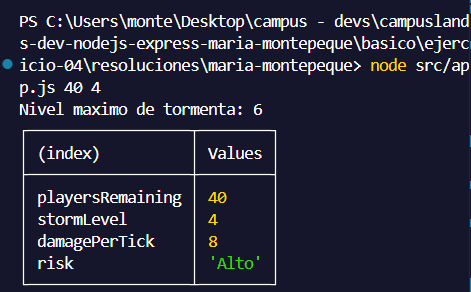
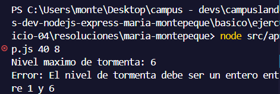

# Ejercicio 04 - modulos ES Modules (Maria Montepeque)

## Que hace

Script Node.js con tematica battle royale, enfocado en demostrar ES Modules
combinando export nombrado y export por defecto en el mismo archivo.

`src/services/storm.service.js` exporta `MAX_STORM_LEVEL` (nombrado) y
`calculateStormDamage` (por defecto). La funcion valida que los jugadores
restantes sean un numero entero mayor o igual a 0, y que el nivel de tormenta
sea un numero entero entre 1 y `MAX_STORM_LEVEL`. Segun el nivel de tormenta,
calcula el dano por tick y asigna un nivel de riesgo (`Bajo`, `Moderado`,
`Alto` o `Critico`).

`src/app.js` importa ambos exports en una sola linea
(`import calculateStormDamage, { MAX_STORM_LEVEL } from ...`) y muestra el
resultado con `console.table`.

Si algun valor no es valido, se lanza un error y el proceso termina con
`process.exitCode = 1`.

## Como ejecutar

```bash
npm install
npm start
npm run dev
```

## Reultados esperados
```node src/app.js 40 4```



```node src/app.js 40 8```

