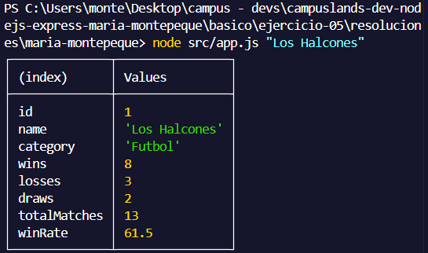
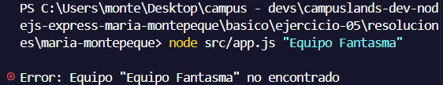

# Ejercicio 05 - fs para leer archivos (Maria Montepeque)

## Que hace

Script Node.js con tematica futbol y futbol sala, enfocado en leer archivos con el
modulo `fs`.

`src/services/teams.service.js` lee de forma sincrona (`readFileSync`) el archivo
`src/data/teams.json`, busca un equipo por nombre (sin distinguir mayusculas o
minusculas) y calcula estadisticas derivadas: total de partidos jugados y porcentaje
de victorias (`winRate`).

`src/app.js` llama al service y muestra el resultado con `console.table`.

Si el nombre del equipo viene vacio o no existe en los datos, se lanza un error y el
proceso termina con `process.exitCode = 1`.

## Como ejecutar

```bash
npm install
npm start
npm run dev
```
## Resuktado esperado

```node src/app.js "Los Halcones"```


```node src/app.js "Equipo Fantasma"```
