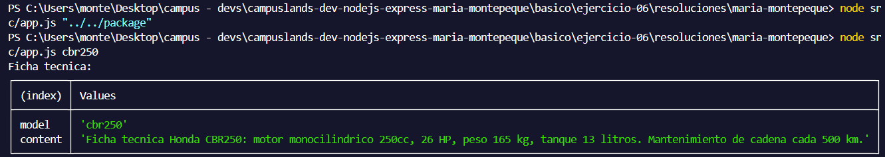
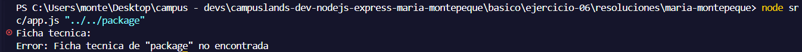

# Ejercicio 06 - path y rutas seguras (Maria Montepeque)

## Que hace

Script Node.js con tematica motos y mecanica, enfocado en construir rutas de
archivo de forma segura con el modulo `path`, evitando path traversal.

`src/services/specs.service.js` recibe el modelo de una moto, valida que no venga
vacio, sanea el valor con `path.normalize` y arma la ruta hacia
`src/data/specs/<modelo>.txt`. Antes de leer el archivo, calcula la ruta relativa
con `path.relative` respecto a la carpeta de fichas tecnicas: si esa ruta empieza
con `".."` o es absoluta, la rechaza como invalida. Asi se garantiza que nunca se
pueda salir de `data/specs/`, sin importar que reciba algo como `../../package`.

`src/app.js` llama al service y muestra el resultado con `console.table`.

Si el modelo no es valido o el archivo no existe, se lanza un error y el proceso
termina con `process.exitCode = 1`.

## Como ejecutar

```bash
npm install
npm start
npm run dev
```

## Resultado esperado
```node src/app.js cbr250```



```node src/app.js "../../package"```

