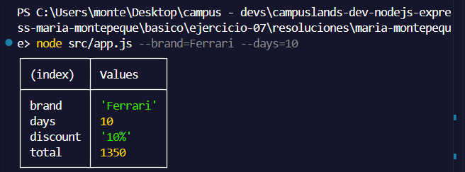
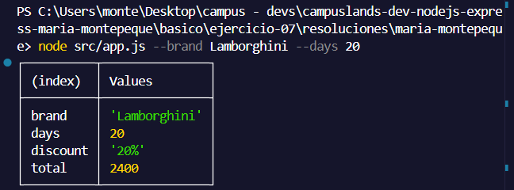
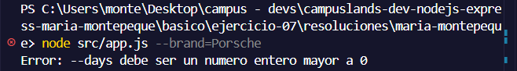

# Ejercicio 07 - process.argv y CLI (Maria Montepeque)

## Que hace

Script Node.js con tematica autos de lujo, enfocado en parsear argumentos de
linea de comandos desde `process.argv`.

`src/services/rental.service.js` expone `parseArgs`, que recorre `process.argv`
y soporta dos formatos de flags: `--flag=valor` y `--flag valor` (separado por
espacio), devolviendo un `Map` con los valores encontrados.

`quoteRental` toma esos flags y calcula la cotizacion de alquiler de un auto de
lujo: valida que `--brand` no venga vacio y que `--days` sea un numero entero
mayor a 0. Segun la cantidad de dias, aplica un descuento escalonado (5% desde
3 dias, 10% desde 7 dias, 20% desde 14 dias) sobre la tarifa diaria.

`src/app.js` parsea los argumentos y muestra la cotizacion con `console.table`.

Si `--brand` o `--days` son invalidos, se lanza un error y el proceso termina
con `process.exitCode = 1`.

## Como ejecutar

```bash
npm install
npm start -- --brand=Ferrari --days=10
```

## Resultado esperado

```node src/app.js --brand=Ferrari --days=10```



```node src/app.js --brand Lamborghini --days 20```



```node src/app.js --brand=Porsche```

