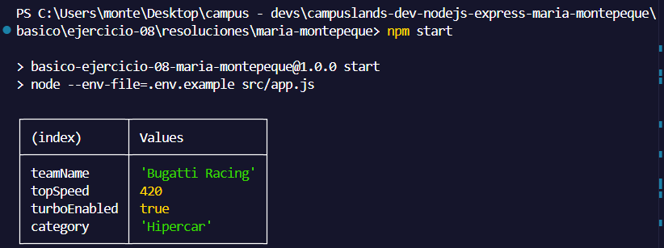
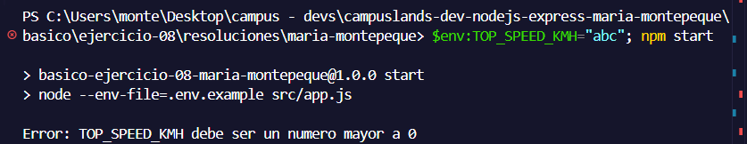

# Ejercicio 08 - variables de entorno (Maria Montepeque)

## Que hace

Script Node.js con tematica hiperdeportivos, enfocado en leer configuracion desde
variables de entorno con `process.env`, cargadas mediante el flag nativo de Node
`--env-file=.env.example` (sin usar la libreria `dotenv`).

`src/services/env.service.js` expone `loadRaceConfig`, que lee tres variables:

- `TEAM_NAME`: nombre del equipo, valida que no venga vacio.
- `TOP_SPEED_KMH`: velocidad maxima, valida que sea un numero mayor a 0.
- `TURBO_ENABLED`: valida que sea exactamente `"true"` o `"false"` (texto) y lo
  convierte a un booleano real, ya que `process.env` siempre entrega strings.

Segun la velocidad maxima, asigna una categoria (`Hipercar`, `Superdeportivo` o
`GT`).

`src/app.js` llama al service y muestra el resultado con `console.table`.

Si alguna variable falta o es invalida, se lanza un error y el proceso termina con
`process.exitCode = 1`.

## Como ejecutar

```bash
npm install
npm start
npm run dev
```

## Resultado esperado
```npm start```



```$env:TOP_SPEED_KMH="abc"; npm start``` (caso de error)

