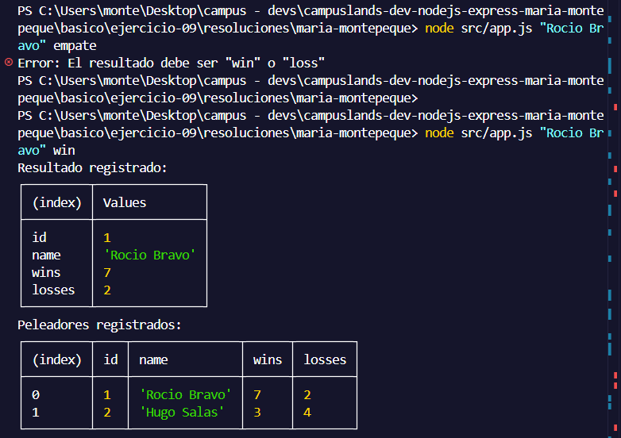
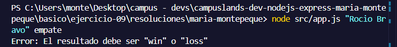

# Ejercicio 09 - JSON y persistencia simple (Maria Montepeque)

## Que hace

Script Node.js con tematica kickboxing, enfocado en leer y escribir un archivo
JSON para persistir cambios (persistencia simple, sin base de datos).

`src/services/fighters.service.js` expone:

- `listFighters`: lee `src/data/fighters.json` de forma sincrona y devuelve el
  arreglo de peleadores.
- `recordResult(nombre, resultado)`: valida que el nombre no venga vacio y que
  el resultado sea exactamente `"win"` o `"loss"`. Busca al peleador por nombre
  (sin distinguir mayusculas), incrementa su contador de victorias o derrotas, y
  **reescribe el archivo JSON completo** con el cambio ya guardado en disco.

`src/app.js` registra el resultado (si se pasan argumentos) y luego muestra la
lista completa de peleadores con `console.table`.

Si el nombre es invalido, el resultado no es `"win"`/`"loss"`, o el peleador no
existe, se lanza un error y el proceso termina con `process.exitCode = 1`.

## Como ejecutar

```bash
npm install
npm start
```

## Resultado esperado

```node src/app.js "Rocio Bravo" win```


```node src/app.js "Rocio Bravo" empate```

