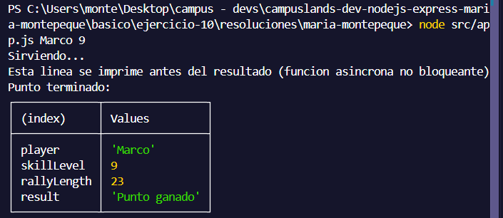
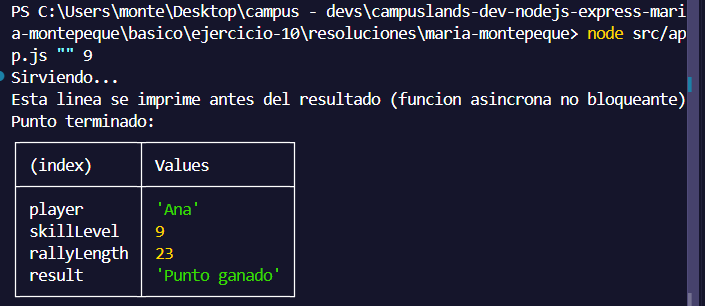

# Ejercicio 10 - funciones asincronas (Maria Montepeque)

## Que hace

Script Node.js con tematica pingpong, enfocado en demostrar funciones asincronas
con callbacks y `setTimeout` (paso previo a Promesas y `async/await`).

`src/services/match.service.js` expone `playMatch(playerName, skillLevel,
onSuccess, onError)`: valida que el nombre del jugador no venga vacio y que el
nivel de habilidad sea un numero mayor a 0. Usa `setTimeout` para simular el
tiempo que tarda un punto en resolverse, sin bloquear el hilo principal, y
calcula de forma determinista (sin azar) la duracion del rally y si el punto se
gana o se pierde, segun el nivel de habilidad.

En vez del patron error-first de un solo callback, usa **dos callbacks
separados**: `onSuccess` para el resultado y `onError` para los errores de
validacion.

`src/app.js` llama a la funcion e imprime una linea justo despues de la
llamada, para demostrar que el codigo sigue ejecutandose antes de que llegue el
resultado del punto.

## Como ejecutar

```bash
npm install
npm start
```

## Resultados esperados

```node src/app.js Marco 9```



```node src/app.js "" 9```

