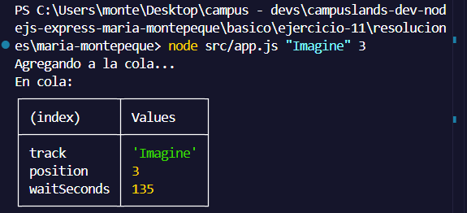
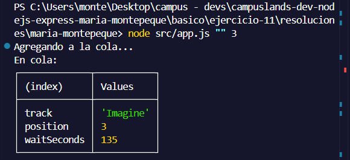

# Ejercicio 11 - promesas basicas (Maria Montepeque)

## Que hace

Script Node.js con tematica musica, enfocado en demostrar Promesas basicas
(`new Promise`, `.then()`, `.catch()`), sin usar todavia `async/await`.

`src/services/queue.service.js` expone:

- `queueTrack(nombre, posicion)`: devuelve una Promise que valida que el nombre
  de la cancion no venga vacio y que la posicion sea un numero entero mayor a
  0. Resuelve tras un `setTimeout` (simulando una operacion que toma tiempo) o
  rechaza con un error de validacion.
- `estimateWait(queued)`: devuelve otra Promise que calcula, de forma
  determinista (sin azar), el tiempo de espera segun la posicion en la cola.

`src/app.js` **encadena ambas promesas** con `.then().then().catch()`: primero
agrega la cancion a la cola, luego calcula el tiempo de espera, y si algo falla
en cualquier paso de la cadena, cae en el mismo `.catch()`.

Si el nombre o la posicion son invalidos, el proceso termina con
`process.exitCode = 1`.

## Como ejecutar

```bash
npm install
npm start
```

## Resultados esperados

```node src/app.js "Imagine" 3```



```node src/app.js "" 3```

