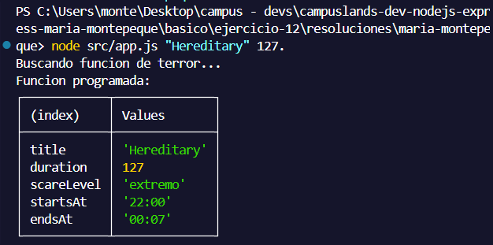
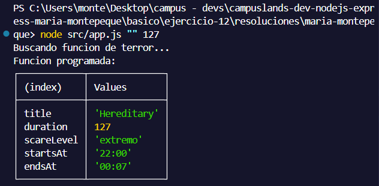
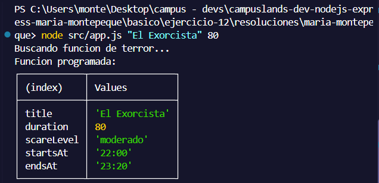
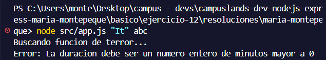

# Ejercicio 12 - async await (Maria Montepeque)

## Que hace

Script Node.js con tematica peliculas de miedo, enfocado en demostrar
`async/await` con `try/catch` y `Promise.all`.

`src/services/screening.service.js` expone tres funciones `async`:

- `findMovie(titulo, minutos)`: valida que el titulo no venga vacio y que la
  duracion sea un entero mayor a 0. Lanza un error de validacion o devuelve la
  pelicula tras una espera simulada.
- `getScareLevel(movie)`: calcula el nivel de miedo segun la duracion
  (moderado, alto o extremo).
- `getShowtime(movie)`: calcula la hora de inicio y fin de la funcion nocturna.

`src/app.js` usa `await` para obtener la pelicula y luego `Promise.all` para
ejecutar en paralelo el nivel de miedo y el horario. Cualquier error cae en el
`catch` y el proceso termina con `process.exitCode = 1`.

## Como ejecutar

```bash
npm install
npm start
```

## Resultados esperados
```node src/app.js "Hereditary" 127```



```node src/app.js "" 127```



```node src/app.js "El Exorcista" 80```



## Validación - Error
```node src/app.js "It" abc```

