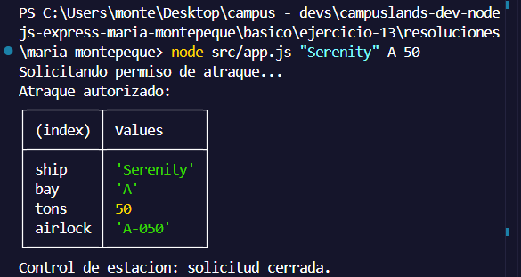
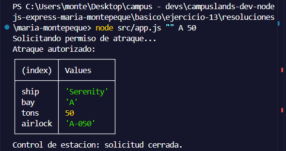
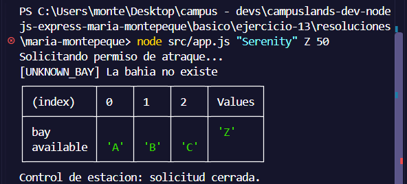
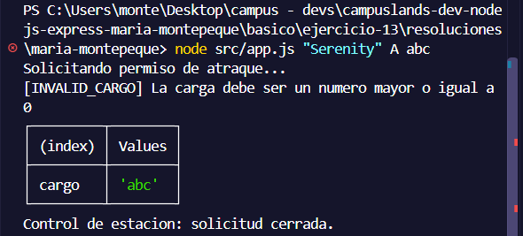
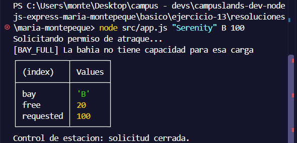
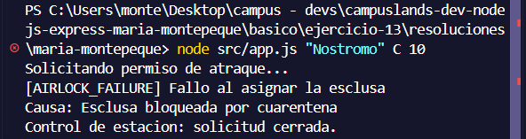

# Ejercicio 13 - manejo de errores (Maria Montepeque)

## Que hace

Script Node.js con tematica ciencia ficcion, enfocado en manejo de errores:
errores personalizados con `code` y `details`, `try/catch/finally`,
envoltura de errores con `cause` y un manejador centralizado.

`src/errors/app-error.js` define `AppError`, que extiende `Error` y agrega un
`code` identificable y un objeto `details` con contexto.

`src/services/docking.service.js` expone `requestDocking({ ship, bay, cargo })`:
valida nave, bahia y carga, revisa la capacidad disponible y asigna una esclusa.
Cada fallo lanza un `AppError` con su codigo: `INVALID_SHIP`, `UNKNOWN_BAY`,
`INVALID_CARGO`, `BAY_FULL` o `AIRLOCK_FAILURE` (este ultimo envuelve el error
original en `cause`).

`src/app.js` ejecuta la solicitud dentro de `try/catch/finally`. La funcion
`handleError` distingue entre `AppError` (muestra codigo, detalles y causa) y
errores inesperados. En cualquier fallo el proceso termina con
`process.exitCode = 1`.

## Como ejecutar

```bash
npm install
npm start
```

## Resultados esperados

```node src/app.js "Serenity" A 50```



```node src/app.js "" A 50```



```node src/app.js "Serenity" Z 50```



```node src/app.js "Serenity" A abc```



```node src/app.js "Serenity" B 100```



```node src/app.js "Nostromo" C 10```

