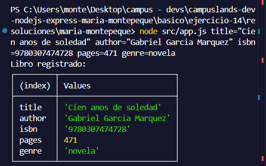
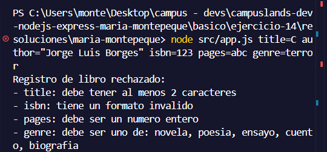
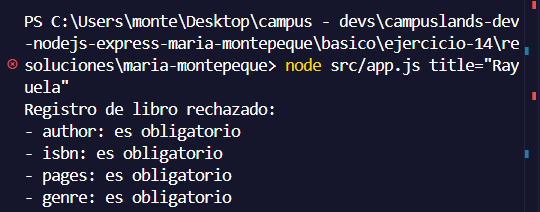
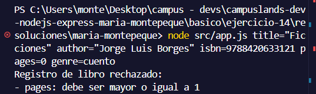

# Ejercicio 14 - validacion de entrada (Maria Montepeque)

## Que hace

Script Node.js con tematica libros, enfocado en validacion de entrada mediante
un esquema declarativo reutilizable.

`src/validators/validate.js` expone `validate(schema, input)`: recorre cada
campo del esquema, aplica sus reglas (`required`, `string`, `minLength`,
`integer`, `min`, `max`, `oneOf`, `pattern`), agrupa los errores por campo y
devuelve los datos ya limpios (`trim` y `cast`).

`src/schemas/book.schema.js` define las reglas de un libro: `title`, `author`,
`isbn` (13 digitos), `pages` (entero entre 1 y 5000) y `genre` (novela, poesia,
ensayo, cuento o biografia).

`src/app.js` recibe los datos como argumentos `clave=valor`, valida contra el
esquema y muestra la tabla del libro registrado o la lista de errores por campo,
terminando con `process.exitCode = 1` si la entrada es invalida.

## Como ejecutar

```bash
npm install
npm start
```

## Resultados esperados

```node src/app.js title="Cien anos de soledad" author="Gabriel Garcia Marquez" isbn=9780307474728 pages=471 genre=novela```



```node src/app.js title=C author="Jorge Luis Borges" isbn=123 pages=abc genre=terror```



```node src/app.js title="Rayuela"```



```node src/app.js title="Ficciones" author="Jorge Luis Borges" isbn=9788420633121 pages=0 genre=cuento```

