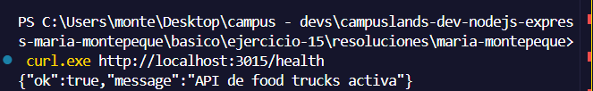
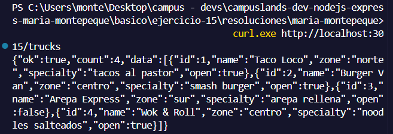
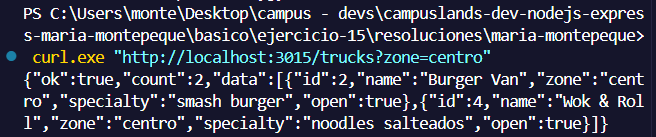
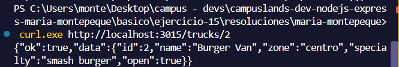
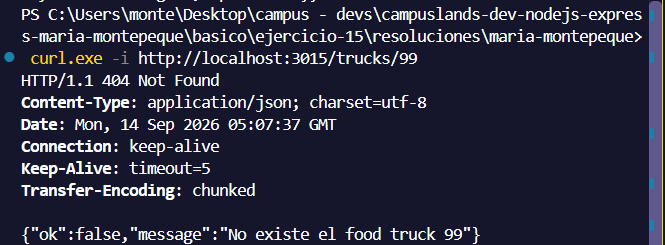
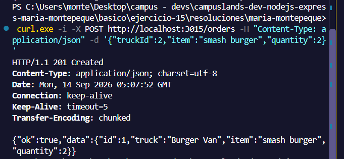
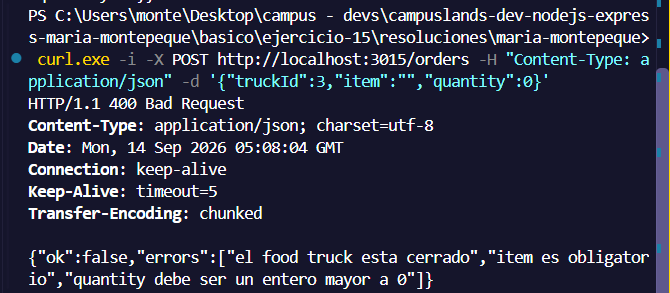
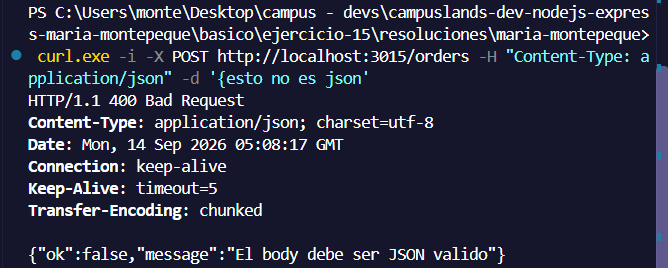
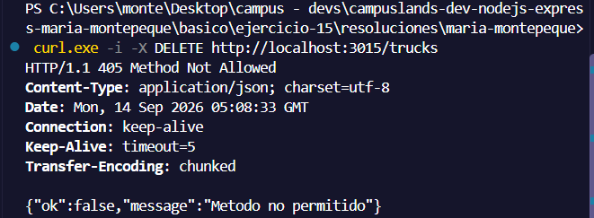
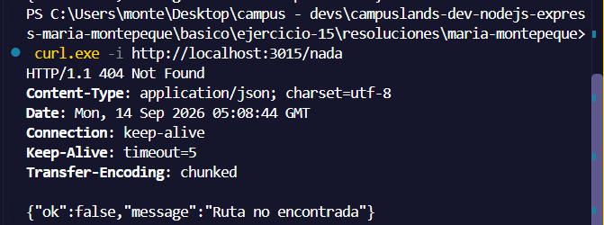

# Ejercicio 15 - mini API HTTP nativa (Maria Montepeque)

## Que hace

Mini API de food trucks construida solo con `node:http` (sin Express).

- `src/server.js`: crea el servidor y escucha en `PORT` (3015 por defecto).
- `src/app.js`: registra las rutas y despacha cada peticion.
- `src/router.js`: mini enrutador con soporte de parametros (`/trucks/:id`)
  y deteccion de metodo no permitido.
- `src/http.js`: helpers `sendJson` y `readJson` (lee el body del stream).
- `src/services/trucks.service.js`: logica de negocio sobre datos en memoria.

## Endpoints

| Metodo | Ruta                 | Descripcion                          |
| ------ | -------------------- | ------------------------------------ |
| GET    | `/health`            | Estado de la API                     |
| GET    | `/trucks`            | Lista de food trucks                 |
| GET    | `/trucks?zone=centro`| Filtra por zona (norte, centro, sur) |
| GET    | `/trucks/:id`        | Detalle de un food truck             |
| POST   | `/orders`            | Crea un pedido (body JSON)           |

Codigos usados: 200, 201, 400 (validacion o JSON invalido), 404 (ruta o
recurso inexistente) y 405 (metodo no permitido).

## Como ejecutar

```bash
npm install
npm start
```

## Resultados esperados

```curl.exe http://localhost:3015/health```



```curl.exe http://localhost:3015/trucks```



```curl.exe "http://localhost:3015/trucks?zone=centro"```



```curl.exe http://localhost:3015/trucks/2```



```curl.exe -i http://localhost:3015/trucks/99```



```curl.exe -i -X POST http://localhost:3015/orders -H "Content-Type: application/json" -d "{\"truckId\":2,\"item\":\"smash burger\",\"quantity\":2}"```



```curl.exe -i -X POST http://localhost:3015/orders -H "Content-Type: application/json" -d "{\"truckId\":3,\"item\":\"\",\"quantity\":0}"```



```curl.exe -i -X POST http://localhost:3015/orders -H "Content-Type: application/json" -d "{esto no es json"```



```curl.exe -i -X DELETE http://localhost:3015/trucks```



```curl.exe -i http://localhost:3015/nada```

