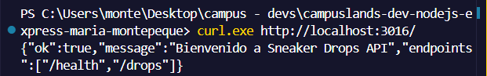
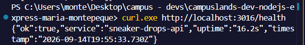
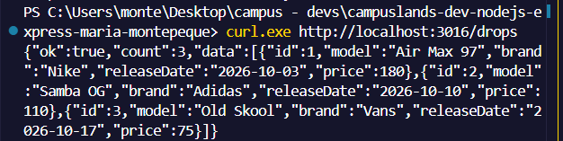
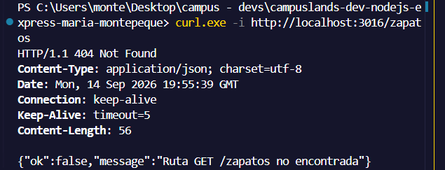
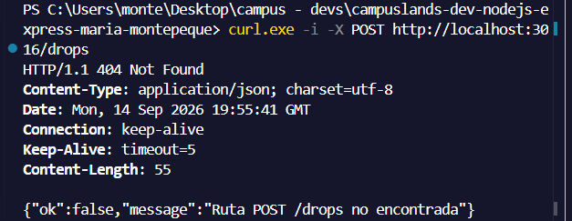

# Ejercicio 16 - primer servidor (Maria Montepeque)

## Que hace

Primer servidor HTTP con tematica ropa y sneakers, construido solo con
`node:http` (sin Express), replicando la forma de trabajar de un servidor
Express: `app.get`, `app.use`, `app.listen` y `res.status().json()`.

- `src/core/create-app.js`: fabrica `createApp()`, que registra rutas por
  metodo y path, extiende `res` con `status()` y `json()`, y aplica un
  manejador 404 por defecto.
- `src/routes/health.routes.js`: `GET /health` con `uptime` y `timestamp`.
- `src/routes/drops.routes.js`: `GET /drops` con los proximos lanzamientos.
- `src/app.js`: arma la aplicacion, registra las rutas y el 404.
- `src/server.js`: levanta el servidor en `PORT` (3016 por defecto).

## Endpoints

| Metodo | Ruta      | Descripcion                          |
| ------ | --------- | ------------------------------------ |
| GET    | `/`       | Bienvenida y lista de endpoints      |
| GET    | `/health` | Estado del servicio, uptime y fecha  |
| GET    | `/drops`  | Proximos lanzamientos de sneakers    |

Cualquier otra ruta responde 404 en JSON.

## Como ejecutar

```bash
npm install
npm start
```

## Resultados esperados

```curl.exe http://localhost:3016/```



```curl.exe http://localhost:3016/health```



```curl.exe http://localhost:3016/drops```



```curl.exe -i http://localhost:3016/zapatos```



```curl.exe -i -X POST http://localhost:3016/drops```

