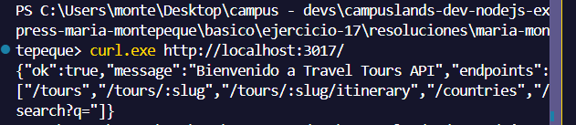
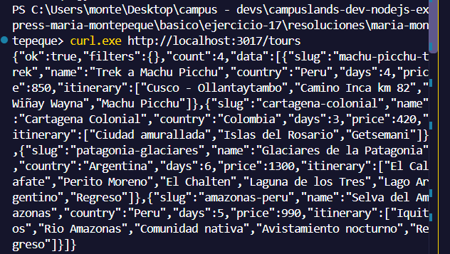
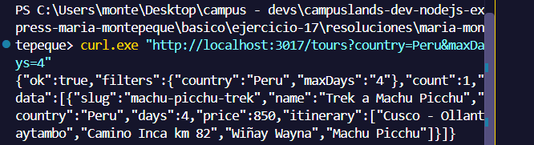
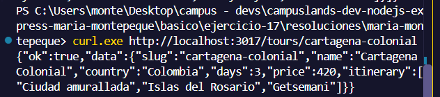
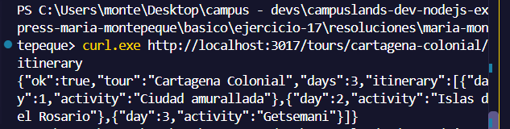
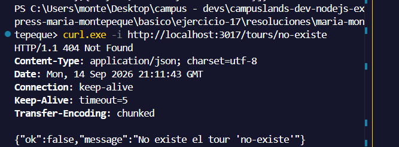
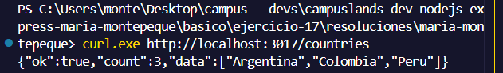
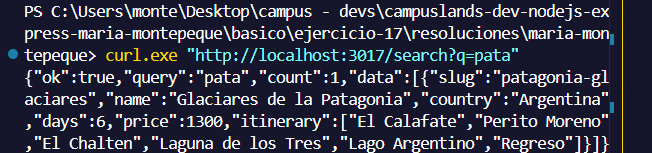
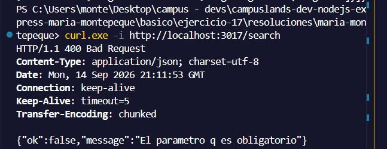
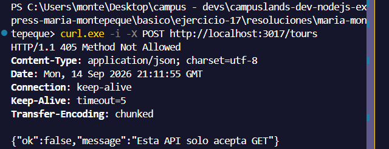

# Ejercicio 17 - rutas GET (Maria Montepeque)

## Que hace

API de tours turisticos enfocada en rutas GET, construida solo con `node:http`
(sin Express). Separa capas: `routes` registra las rutas, `controllers`
responde HTTP y `services` contiene la logica sobre los datos en memoria.

- `src/core/router.js`: mini enrutador GET con parametros de ruta (`:slug`)
  que llena `req.params` y `req.query`.
- `src/core/response.js`: helper `json(res, status, payload)`.
- `src/app.js`: registra rutas, rechaza metodos distintos de GET (405) y
  responde 404 para rutas desconocidas.

## Endpoints

| Ruta                         | Descripcion                                          |
| ---------------------------- | ---------------------------------------------------- |
| `GET /`                      | Bienvenida y lista de endpoints                      |
| `GET /tours`                 | Lista de tours                                       |
| `GET /tours?country=Peru`    | Filtra por pais                                      |
| `GET /tours?maxDays=4`       | Filtra por duracion maxima                           |
| `GET /tours/:slug`           | Detalle de un tour                                   |
| `GET /tours/:slug/itinerary` | Itinerario dia a dia del tour                        |
| `GET /countries`             | Paises disponibles (sin repetir)                     |
| `GET /search?q=texto`        | Busca por nombre o pais (400 si falta `q`)           |

## Como ejecutar

```bash
npm install
npm start
```

## Resultados esperados

```curl.exe http://localhost:3017/```



```curl.exe http://localhost:3017/tours```



```curl.exe "http://localhost:3017/tours?country=Peru&maxDays=4"```



```curl.exe http://localhost:3017/tours/cartagena-colonial```



```curl.exe http://localhost:3017/tours/cartagena-colonial/itinerary```



```curl.exe -i http://localhost:3017/tours/no-existe```



```curl.exe http://localhost:3017/countries```



```curl.exe "http://localhost:3017/search?q=pata"```



```curl.exe -i http://localhost:3017/search```



```curl.exe -i -X POST http://localhost:3017/tours```

