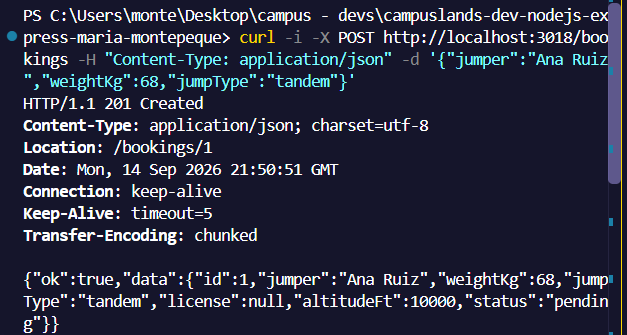
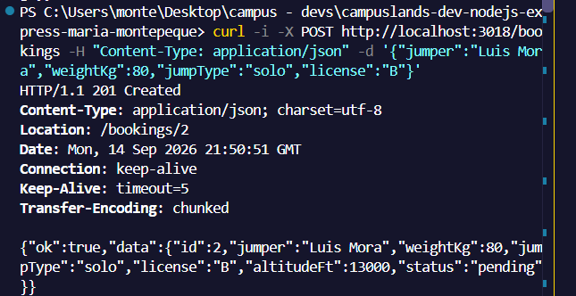
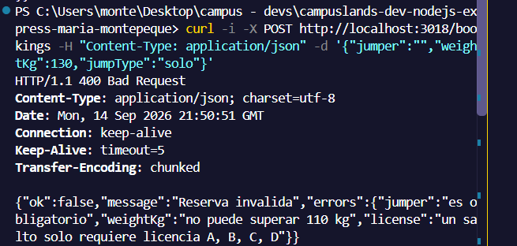
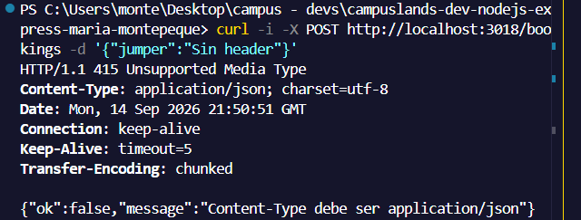
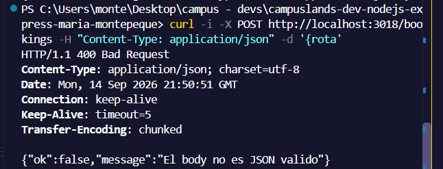
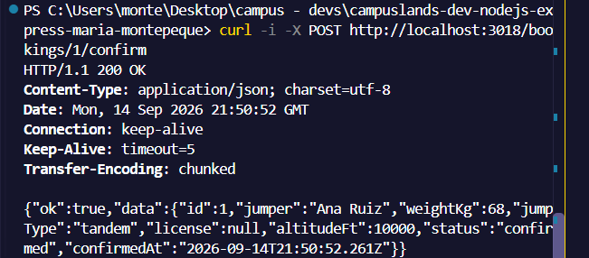
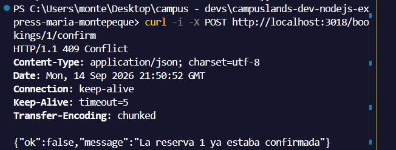
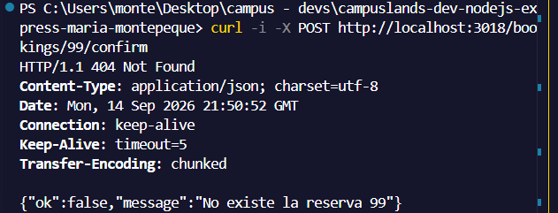
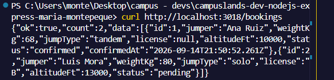
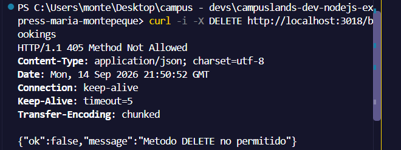

# Ejercicio 18 - rutas POST (Maria Montepeque)

## Que hace

API de reservas de saltos en paracaidas enfocada en rutas POST, construida
solo con `node:http` (sin Express).

- `src/core/body.js`: lee el body del stream, exige `Content-Type:
  application/json` (415) y rechaza JSON invalido o vacio (400).
- `src/core/router.js`: enrutador con `get`/`post`, parametros de ruta y
  deteccion de metodo no permitido (405).
- `src/services/bookings.service.js`: validacion por campo, reglas cruzadas
  (un salto `solo` exige licencia A-D, peso maximo 110 kg) y transicion de
  estado `pending -> confirmed`.
- `src/controllers/bookings.controller.js`: traduce resultados a codigos HTTP
  (201 con cabecera `Location`, 400, 404, 409).

## Endpoints

| Metodo | Ruta                    | Descripcion                              |
| ------ | ----------------------- | ---------------------------------------- |
| GET    | `/`                     | Bienvenida                               |
| GET    | `/bookings`             | Lista de reservas                        |
| POST   | `/bookings`             | Crea una reserva (body JSON)             |
| POST   | `/bookings/:id/confirm` | Confirma una reserva pendiente           |

Body de `POST /bookings`:

```json
{ "jumper": "Ana Ruiz", "weightKg": 68, "jumpType": "solo", "license": "B" }
```

## Resultados esperados

```curl -i -X POST http://localhost:3018/bookings -H "Content-Type: application/json" -d '{"jumper":"Ana Ruiz","weightKg":68,"jumpType":"tandem"}'```



```curl -i -X POST http://localhost:3018/bookings -H "Content-Type: application/json" -d '{"jumper":"Luis Mora","weightKg":80,"jumpType":"solo","license":"B"}'```



```curl -i -X POST http://localhost:3018/bookings -H "Content-Type: application/json" -d '{"jumper":"","weightKg":130,"jumpType":"solo"}'```



```curl -i -X POST http://localhost:3018/bookings -d '{"jumper":"Sin header"}'```



```curl -i -X POST http://localhost:3018/bookings -H "Content-Type: application/json" -d '{rota'```



```curl -i -X POST http://localhost:3018/bookings/1/confirm```



```curl -i -X POST http://localhost:3018/bookings/1/confirm```



```curl -i -X POST http://localhost:3018/bookings/99/confirm```



```curl http://localhost:3018/bookings```



```curl -i -X DELETE http://localhost:3018/bookings```


