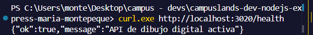
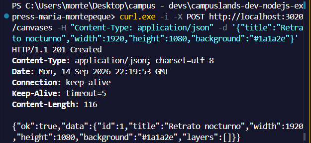
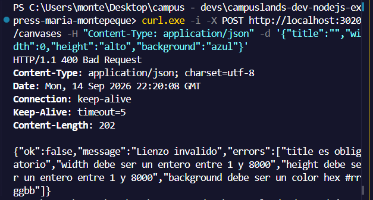
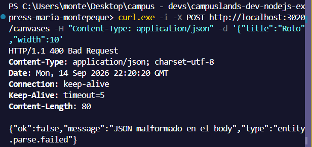
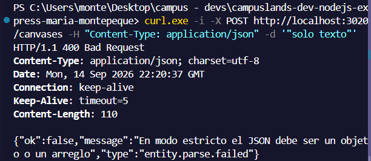
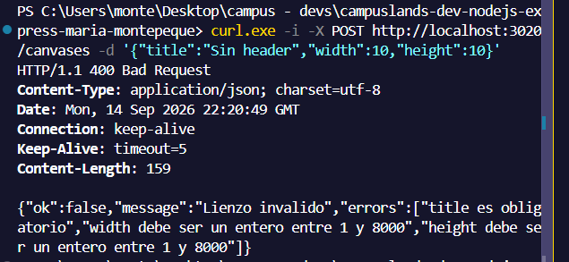
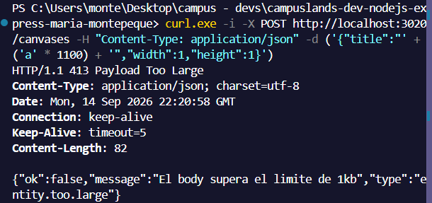
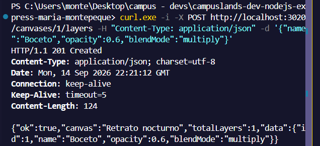
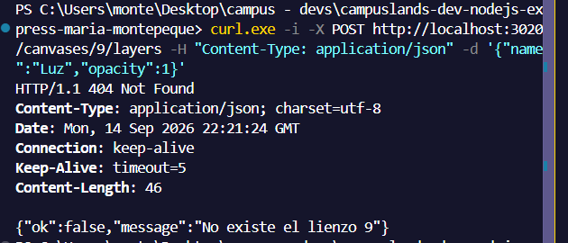
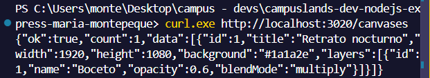

# Ejercicio 20 - middleware json (Maria Montepeque)

## Que hace

API de lienzos de dibujo digital que implementa, solo con `node:http`, el
equivalente al middleware `express.json()`: una cadena de middlewares con
`next()` y un parser de body JSON configurable.

- `src/core/create-app.js`: `createApp()` con `use`, `get`, `post` y una
  cadena de middlewares estilo Express (`next()`, `next(err)`, manejadores de
  error con 4 argumentos, `res.status().json()`).
- `src/middlewares/json-body.js`: `jsonBody({ limit, strict })`. Solo actua en
  `POST/PUT/PATCH` con `Content-Type: application/json`; respeta un limite de
  tamano (413), en modo estricto exige objeto o arreglo (400), rechaza JSON
  malformado (400) y deja el resultado en `req.body`.
- `src/middlewares/error-handler.js`: traduce errores a JSON con su `status`
  y `type` (`entity.parse.failed`, `entity.too.large`).
- `src/services/canvases.service.js`: crea lienzos y agrega capas con
  validacion de dimensiones, color hex, opacidad y modo de fusion.

## Endpoints

| Metodo | Ruta                   | Descripcion                          |
| ------ | ---------------------- | ------------------------------------ |
| GET    | `/health`              | Estado de la API                     |
| GET    | `/canvases`            | Lista de lienzos con sus capas       |
| POST   | `/canvases`            | Crea un lienzo (body JSON)           |
| POST   | `/canvases/:id/layers` | Agrega una capa a un lienzo          |

Body de `POST /canvases`:

```json
{ "title": "Retrato nocturno", "width": 1920, "height": 1080, "background": "#1a1a2e" }
```

Body de `POST /canvases/:id/layers`:

```json
{ "name": "Boceto", "opacity": 0.6, "blendMode": "multiply" }
```

## Como ejecutar

```bash
npm install
npm start
```

## Ejemplos de peticiones

```bash```

```curl http://localhost:3020/health```



```curl -i -X POST http://localhost:3020/canvases -H "Content-Type: application/json" -d '{"title":"Retrato nocturno","width":1920,"height":1080,"background":"#1a1a2e"}'```



```curl -i -X POST http://localhost:3020/canvases -H "Content-Type: application/json" -d '{"title":"","width":0,"height":"alto","background":"azul"}'```



```curl -i -X POST http://localhost:3020/canvases -H "Content-Type: application/json" -d '{"title":"Roto","width":10'```



```curl -i -X POST http://localhost:3020/canvases -H "Content-Type: application/json" -d '"solo texto"'```



```curl -i -X POST http://localhost:3020/canvases -d '{"title":"Sin header","width":10,"height":10}'```



```curl -i -X POST http://localhost:3020/canvases/1/layers -H "Content-Type: application/json" -d '{"name":"Boceto","opacity":0.6,"blendMode":"multiply"}'```



```curl -i -X POST http://localhost:3020/canvases/1/layers -H "Content-Type: application/json" -d '{"name":"","opacity":2,"blendMode":"neon"}'```



```curl -i -X POST http://localhost:3020/canvases/9/layers -H "Content-Type: application/json" -d '{"name":"Luz","opacity":1}'```



```curl http://localhost:3020/canvases```


