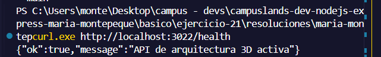
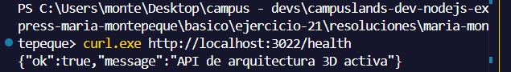
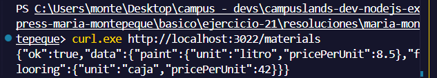
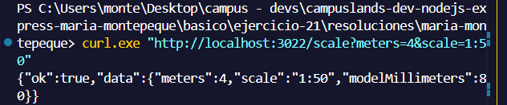
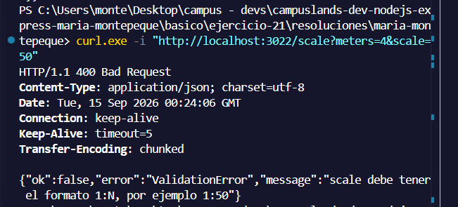
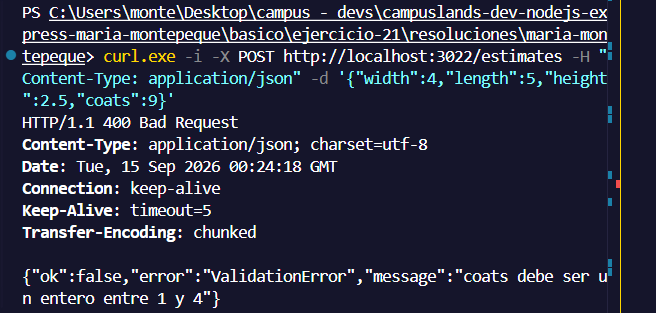
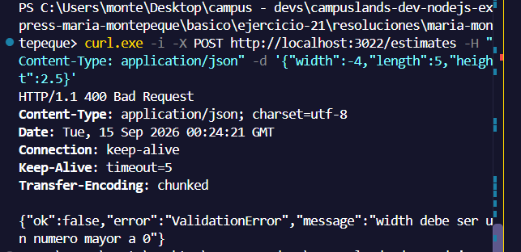

# Ejercicio 22 - servicios simples (Maria Montepeque)

## Que hace

API de estimacion para maquetas de arquitectura 3D, construida solo con
`node:http` (sin Express). El foco esta en los **servicios**: funciones puras,
sin `req`/`res`, que se componen entre si y se prueban de forma aislada con
`node:test`.

```text
src/services/
├── errors.js               ValidationError y assertPositive compartidos
├── geometry.service.js     area de piso, perimetro, paredes netas y volumen
├── materials.service.js    litros de pintura y cajas de piso con costo
├── scale.service.js        metros reales -> milimetros en maqueta (1:N)
├── estimate.service.js     compone los tres anteriores
└── services.test.js        pruebas unitarias de los servicios
```

Los controladores (`src/controllers`) solo leen la entrada y llaman a los
servicios; cualquier `ValidationError` lanzada por un servicio se traduce a
`400` en `src/app.js`.

## Endpoints

| Metodo | Ruta                            | Descripcion                                  |
| ------ | ------------------------------- | -------------------------------------------- |
| GET    | `/health`                       | Estado de la API                             |
| GET    | `/materials`                    | Catalogo de materiales y precios             |
| GET    | `/scale?meters=4&scale=1:50`    | Convierte una medida real a la maqueta       |
| POST   | `/estimates`                    | Geometria, materiales y maqueta de un cuarto |

Body de `POST /estimates`:

```json
{
  "name": "Sala",
  "width": 4,
  "length": 5,
  "height": 2.5,
  "coats": 2,
  "scale": "1:50",
  "openings": [{ "width": 1, "height": 2 }]
}
```

`coats` (1 a 4), `scale` y `openings` son opcionales.

## Como ejecutar

```bash
npm install
npm start
```

## Como probar los servicios sin servidor

```bash
npm test
```

## Ejemplos de peticiones

```bash```

```curl http://localhost:3022/health```



```curl http://localhost:3022/materials```



```curl "http://localhost:3022/scale?meters=4&scale=1:50"```



```curl -i "http://localhost:3022/scale?meters=4&scale=50"```



```curl -X POST http://localhost:3022/estimates -H "Content-Type: application/json" -d '{"name":"Sala","width":4,"length":5,"height":2.5,"openings":[{"width":1,"height":2}]}'```



```curl -i -X POST http://localhost:3022/estimates -H "Content-Type: application/json" -d '{"width":4,"length":5,"height":2.5,"coats":9}'```



```curl -i -X POST http://localhost:3022/estimates -H "Content-Type: application/json" -d '{"width":-4,"length":5,"height":2.5}'```




