# Ejercicio 23 - datos en memoria (Maria Montepeque)

## Que hace

API de inventario de electrodos de soldadura construida solo con `node:http`
(sin Express). Los datos viven **solo en memoria** del proceso: se cargan
desde una semilla al arrancar y se pierden al reiniciar el servidor.

- `src/core/memory-store.js`: `createMemoryStore(seed)`, un almacen generico
  sobre `Map` con `insert`, `findAll`, `findById`, `update`, `remove` y
  `reset`. Asigna ids incrementales y marca `createdAt` / `updatedAt`.
- `src/data/electrodes.seed.js`: datos iniciales.
- `src/services/electrodes.service.js`: reglas de negocio sobre el almacen:
  validacion AWS del `code`, duplicados (409), ajuste de stock con `delta`
  (no permite stock negativo) y alerta `lowStock` calculada al vuelo.
- `GET /stats` muestra cuantos registros hay, el stock total, el uptime y la
  memoria usada, para evidenciar que todo vive en el proceso.
- `POST /reset` vuelve a cargar la semilla.

## Endpoints

| Metodo | Ruta                          | Descripcion                                    |
| ------ | ----------------------------- | ---------------------------------------------- |
| GET    | `/health`                     | Estado de la API                               |
| GET    | `/electrodes`                 | Lista (`?process=SMAW`, `?lowStock=true`)      |
| GET    | `/electrodes/:id`             | Detalle                                        |
| POST   | `/electrodes`                 | Crea un electrodo                              |
| PATCH  | `/electrodes/:id/stock`       | Ajusta stock con `{ "delta": -5 }` o `{ "delta": 20 }` |
| DELETE | `/electrodes/:id`             | Elimina (204)                                  |
| GET    | `/stats`                      | Metricas del inventario en memoria             |
| POST   | `/reset`                      | Restaura la semilla                            |

Body de `POST /electrodes`:

```json
{ "code": "E308L", "diameterMm": 2.5, "process": "SMAW", "stock": 60, "minStock": 25 }
```

## Como ejecutar

```bash
npm install
npm start
```

## Ejemplos de peticiones

```bash```

```curl "http://localhost:3023/electrodes?lowStock=true"```

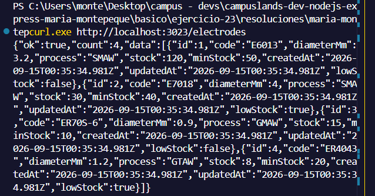

```curl http://localhost:3023/electrodes```

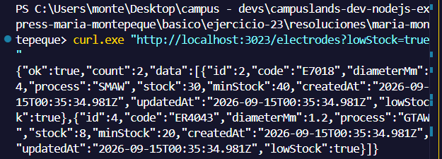

```curl "http://localhost:3023/electrodes?process=smaw"```

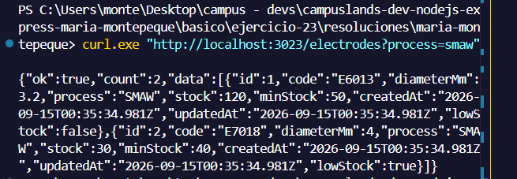

```curl http://localhost:3023/electrodes/2```

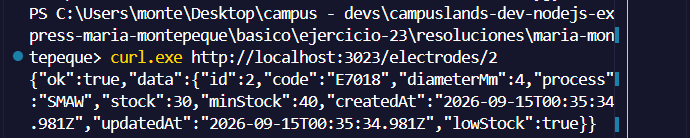

```curl -i -X POST http://localhost:3023/electrodes -H "Content-Type: application/json" -d '{"code":"E308L","diameterMm":2.5,"process":"SMAW","stock":60,"minStock":25}'```

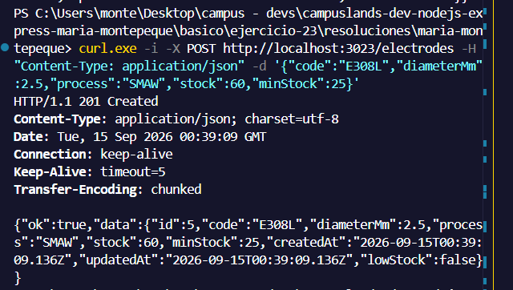

```curl -i -X POST http://localhost:3023/electrodes -H "Content-Type: application/json" -d '{"code":"E308L","diameterMm":2.5,"process":"SMAW","stock":1,"minStock":1}'```

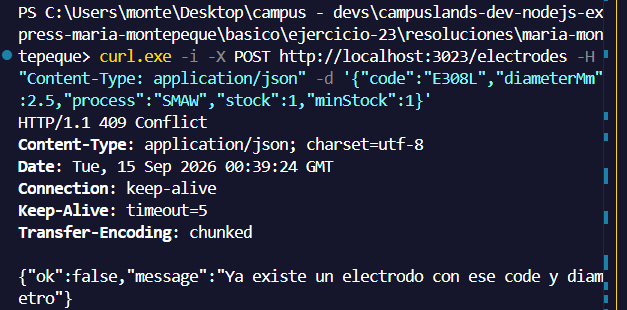

```curl -i -X POST http://localhost:3023/electrodes -H "Content-Type: application/json" -d '{"code":"varilla","diameterMm":0,"process":"LASER","stock":-1,"minStock":"x"}'```

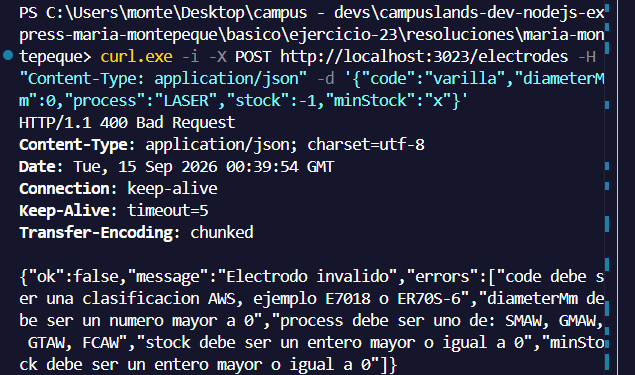

```curl -X PATCH http://localhost:3023/electrodes/2/stock -H "Content-Type: application/json" -d '{"delta":20}'```

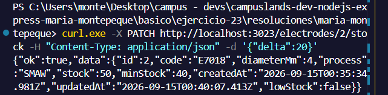

```curl -i -X PATCH http://localhost:3023/electrodes/2/stock -H "Content-Type: application/json" -d '{"delta":-500}'```

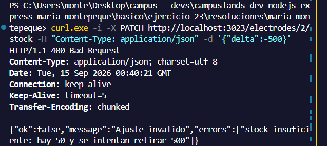

```curl -i -X DELETE http://localhost:3023/electrodes/4```

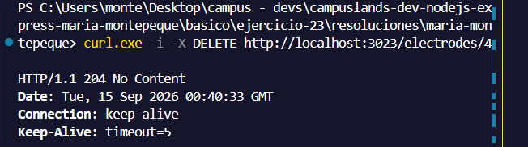

```curl -i -X DELETE http://localhost:3023/electrodes/4```

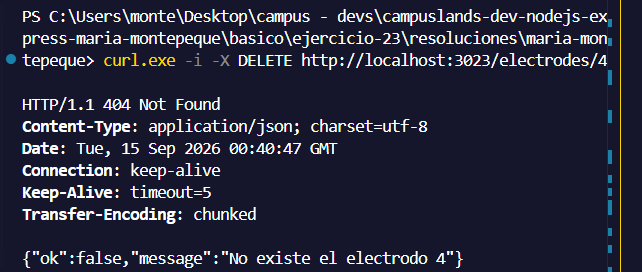

```curl http://localhost:3023/stats```

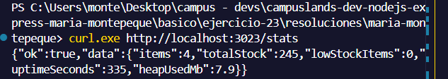

```curl -X POST http://localhost:3023/reset```

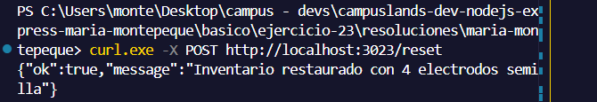

```curl http://localhost:3023/stats```

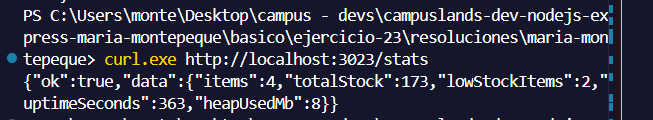