# Ejercicio 24 - CRUD basico (Maria Montepeque)

## Que hace

CRUD completo de reactivos quimicos construido solo con `node:http` (sin
Express). Cada reactivo guarda una formula que se **valida y analiza** al
crear o actualizar: se cuentan los elementos (con soporte de parentesis como
`Ca(OH)2`) y se calcula la masa molar.

- `src/services/formula.service.js`: `parseFormula(formula)` tokeniza la
  formula, rechaza elementos desconocidos o parentesis desbalanceados y
  devuelve `elements` y `molarMass`.
- `src/services/reagents.service.js`: operaciones CRUD sobre un `Map` en
  memoria con validacion completa (POST/PUT) o parcial (PATCH) y control de
  formulas duplicadas (409).
- `src/controllers/reagents.controller.js`: un solo `respond()` traduce el
  resultado del servicio a 200/201/400/404/409 y agrega `Location` al crear.

## Endpoints

| Metodo | Ruta              | Descripcion                                   |
| ------ | ----------------- | --------------------------------------------- |
| GET    | `/reagents`       | Lista (`?search=agua`, `?hazard=toxico`)      |
| POST   | `/reagents`       | Crea (201 + `Location`)                       |
| GET    | `/reagents/:id`   | Detalle                                       |
| PUT    | `/reagents/:id`   | Reemplazo completo (todos los campos)         |
| PATCH  | `/reagents/:id`   | Actualizacion parcial (uno o mas campos)      |
| DELETE | `/reagents/:id`   | Elimina (204)                                 |

Body completo (POST / PUT):

```json
{ "name": "Cloruro de sodio", "formula": "NaCl", "hazard": "ninguno" }
```

`hazard` acepta `ninguno`, `inflamable`, `corrosivo`, `toxico` u `oxidante`.

## Como ejecutar

```bash
npm install
npm start
```

## Ejemplos de peticiones

```bash```

```curl http://localhost:3024/reagents```

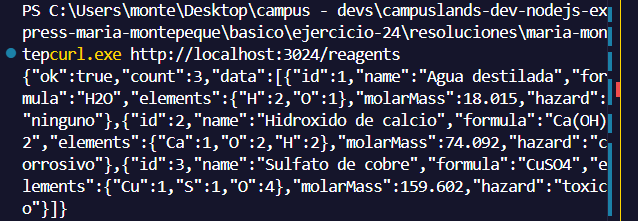

```curl "http://localhost:3024/reagents?search=calcio"```

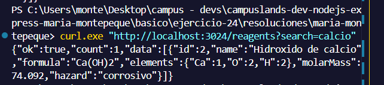

```curl http://localhost:3024/reagents/2```

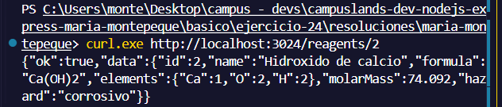

```curl -i -X POST http://localhost:3024/reagents -H "Content-Type: application/json" -d '{"name":"Cloruro de sodio","formula":"NaCl","hazard":"ninguno"}'```

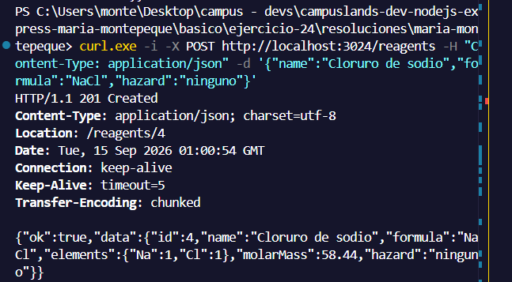

```curl -i -X POST http://localhost:3024/reagents -H "Content-Type: application/json" -d '{"name":"Sal","formula":"NaCl","hazard":"ninguno"}'```

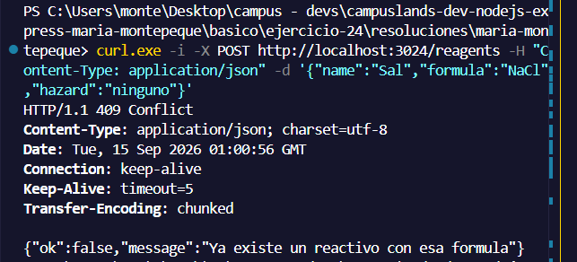

```curl -i -X POST http://localhost:3024/reagents -H "Content-Type: application/json" -d '{"name":"Xx","formula":"Ca(OH","hazard":"radiactivo"}'```

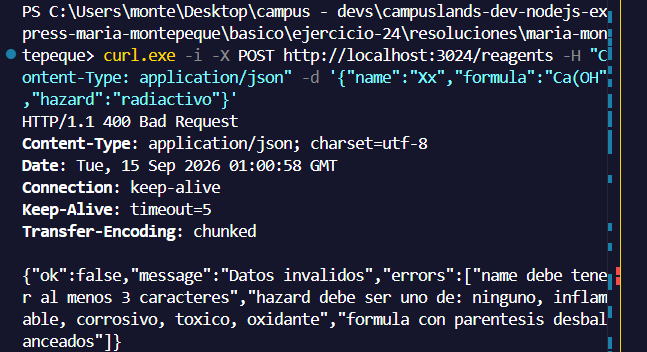

```curl -X PUT http://localhost:3024/reagents/4 -H "Content-Type: application/json" -d '{"name":"Sal de mesa","formula":"NaCl","hazard":"ninguno"}'```

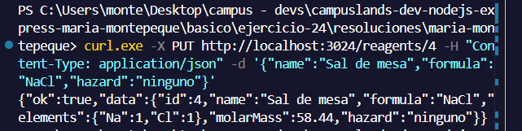

```curl -i -X PUT http://localhost:3024/reagents/4 -H "Content-Type: application/json" -d '{"name":"Sal de mesa"}'```

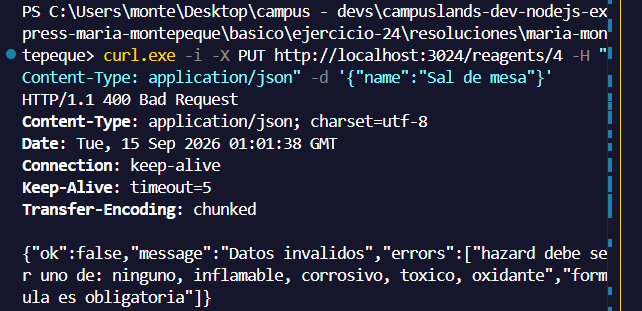

```curl -X PATCH http://localhost:3024/reagents/4 -H "Content-Type: application/json" -d '{"hazard":"oxidante"}'```

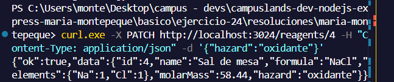

```curl -X PATCH http://localhost:3024/reagents/1 -H "Content-Type: application/json" -d '{"formula":"H2O2"}'```

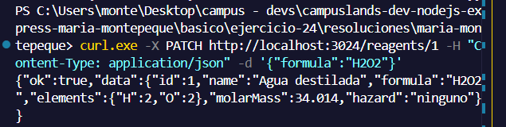

```curl -i -X DELETE http://localhost:3024/reagents/4```

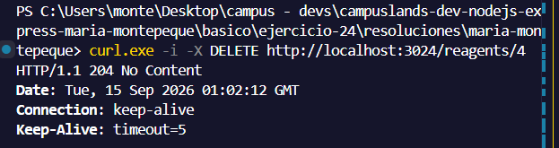

```curl -i -X DELETE http://localhost:3024/reagents/4```

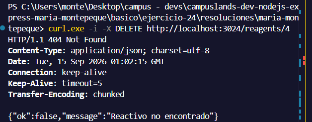
