# Ejercicio 25 - respuestas HTTP correctas (Maria Montepeque)

## Que hace

API de un gremio de heroes RPG construida solo con `node:http` (sin
Express), enfocada en que **cada respuesta HTTP sea correcta**: codigo de
estado adecuado, cabeceras coherentes y un formato de error estandar.

`src/core/reply.js` centraliza las respuestas:

| Helper        | Codigo | Que garantiza                                                    |
| ------------- | ------ | ---------------------------------------------------------------- |
| `ok`          | 200    | `Content-Type`, `Content-Length` y `X-Request-Id` en todo JSON   |
| `created`     | 201    | Cabecera `Location` apuntando al recurso nuevo                   |
| `noContent`   | 204    | Sin body                                                         |
| `cached`      | 200/304| `ETag` + `Cache-Control`; responde 304 si `If-None-Match` coincide |
| `problem`     | 4xx/5xx| Body `application/problem+json` (RFC 9457) con `title`, `status`, `detail`, `instance` |

Ademas `src/app.js`:

- Asigna un `X-Request-Id` a cada peticion y lo devuelve siempre.
- Responde **406** si el cliente no acepta JSON (`Accept: text/html`).
- Responde **405** con cabecera `Allow` cuando la ruta existe pero el metodo no.
- Soporta **HEAD** en las rutas GET (mismas cabeceras, sin body).
- Traduce `HttpError` a su codigo (415 sin `Content-Type` JSON, 400 JSON
  malformado) y cualquier error inesperado a 500 sin filtrar detalles.

Las validaciones de negocio responden **422** (datos bien formados pero
invalidos) con una lista de `errors` por campo, y los conflictos de estado
(nombre repetido, nivel maximo alcanzado) responden **409**.

## Endpoints

| Metodo | Ruta                    | Respuestas posibles                 |
| ------ | ----------------------- | ----------------------------------- |
| GET    | `/health`               | 200 (`Cache-Control: no-store`)     |
| GET    | `/heroes`               | 200, 304                            |
| POST   | `/heroes`               | 201, 400, 409, 415, 422             |
| GET    | `/heroes/:id`           | 200, 304, 400, 404                  |
| POST   | `/heroes/:id/level-up`  | 200, 400, 404, 409                  |
| DELETE | `/heroes/:id`           | 204, 400, 404                       |

Body de `POST /heroes`:

```json
{ "name": "Lyra", "class": "picaro", "level": 3 }
```

## Como ejecutar

```bash
npm install
npm start
```

## Ejemplos de peticiones

```bash```

```curl -i http://localhost:3025/heroes```

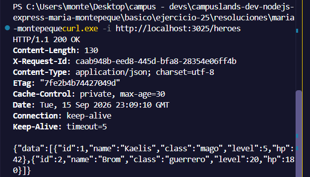

```curl -i http://localhost:3025/heroes/1 -H 'If-None-Match: "<etag de la respuesta anterior>"'```

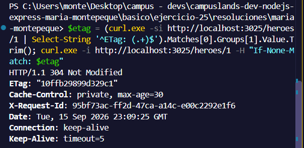

```curl -I http://localhost:3025/heroes```

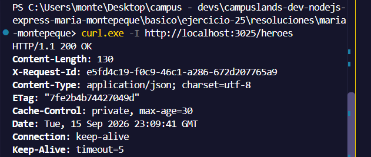

```curl -i http://localhost:3025/heroes -H "Accept: text/html"```

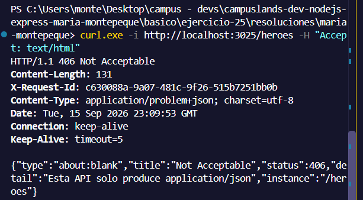

```curl -i -X PUT http://localhost:3025/heroes```

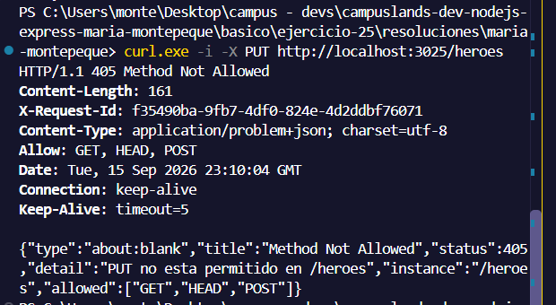

```curl -i -X POST http://localhost:3025/heroes -d '{"name":"Lyra"}'```

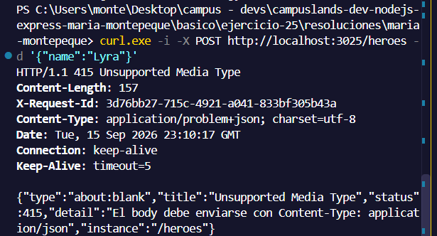

```curl -i -X POST http://localhost:3025/heroes -H "Content-Type: application/json" -d '{rota'```

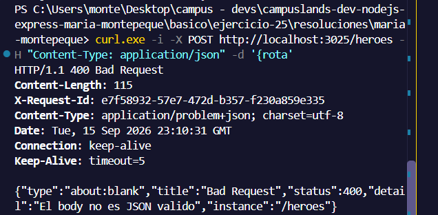

```curl -i -X POST http://localhost:3025/heroes -H "Content-Type: application/json" -d '{"name":"L","class":"bardo","level":99}'```

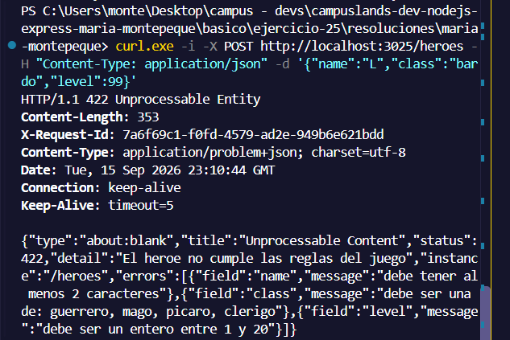

```curl -i -X POST http://localhost:3025/heroes -H "Content-Type: application/json" -d '{"name":"Lyra","class":"picaro","level":3}'```

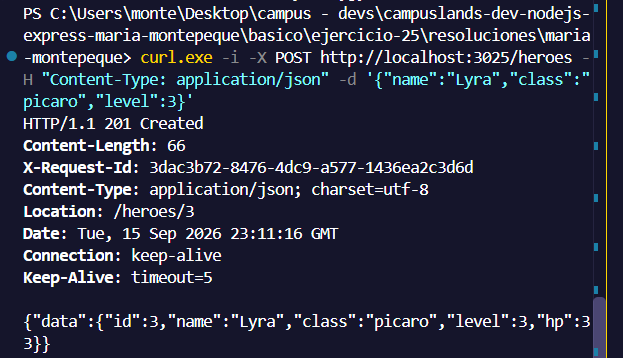

```curl -i -X POST http://localhost:3025/heroes -H "Content-Type: application/json" -d '{"name":"lyra","class":"mago","level":1}'```

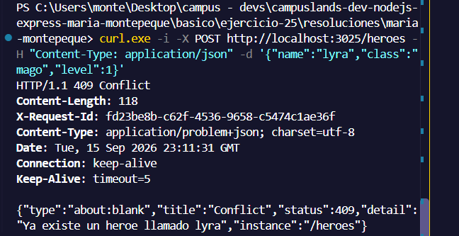

```curl -i -X POST http://localhost:3025/heroes/3/level-up```

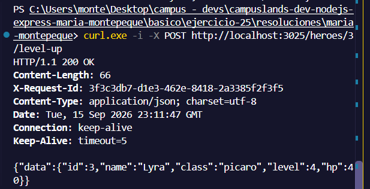

```curl -i -X POST http://localhost:3025/heroes/2/level-up```

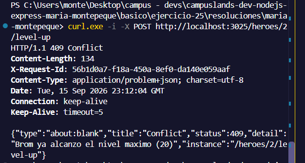

```curl -i http://localhost:3025/heroes/abc```

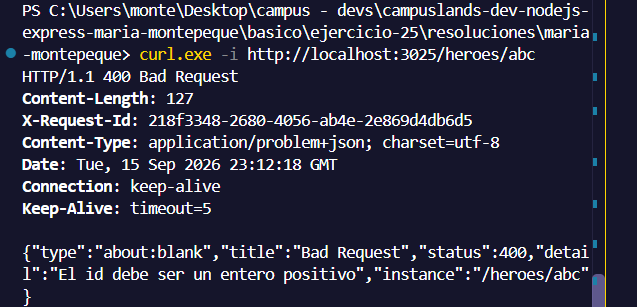

```curl -i -X DELETE http://localhost:3025/heroes/3```

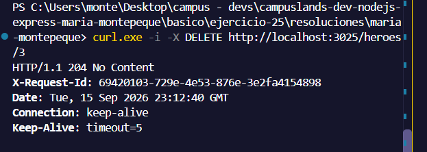

```curl -i -X DELETE http://localhost:3025/heroes/3```

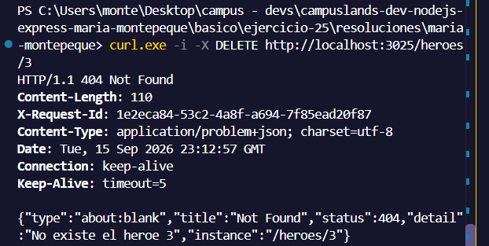
