# Ejercicio 26 - codigos de estado (Maria Montepeque)

## Que hace

API de matchmaking y torneos de un shooter competitivo, construida solo con
`node:http` (sin Express). Cada ruta existe para demostrar **cuando usar cada
codigo de estado**; toda respuesta incluye `status` y `reason` (tomado de
`http.STATUS_CODES`) en el body.

`GET /status-codes` (ruta publica) devuelve el catalogo de los 17 codigos que
usa la API con el caso que los provoca.

Las demas rutas requieren la cabecera `x-api-key` con el nombre del jugador.

| Codigo | Se obtiene con                                                        |
| ------ | --------------------------------------------------------------------- |
| 200    | `GET /players/me`, `GET /queue/:ticketId`, `GET /tournaments/2`       |
| 201    | `POST /tournaments/2/register` (con `Location`)                       |
| 202    | `POST /queue` acepta la busqueda; el ticket pasa a `found` a los 3 s  |
| 204    | `DELETE /queue/:ticketId`                                             |
| 308    | `POST /legacy/queue` redirige a `/queue` conservando el metodo        |
| 400    | body JSON roto o `ticketId` no numerico                               |
| 401    | sin `x-api-key` (con `WWW-Authenticate`)                              |
| 403    | `x-api-key: banned-player`, o cancelar el ticket de otro jugador      |
| 404    | ruta o recurso inexistente                                            |
| 405    | metodo no permitido (con `Allow`)                                     |
| 409    | entrar dos veces a la cola, inscribirse dos veces                     |
| 410    | `GET /tournaments/1` (torneo finalizado)                              |
| 422    | `mode` o `rank` fuera de los valores validos                          |
| 429    | mas de 5 peticiones en 10 s por jugador (con `Retry-After`)           |
| 500    | `GET /crash`                                                          |
| 501    | `GET /replays`                                                        |
| 503    | cualquier ruta tras `POST /maintenance {"enabled":true}`              |

## Como ejecutar

```bash
npm install
npm start
```

## Ejemplos de peticiones

```bash```

```curl -i http://localhost:3026/status-codes```

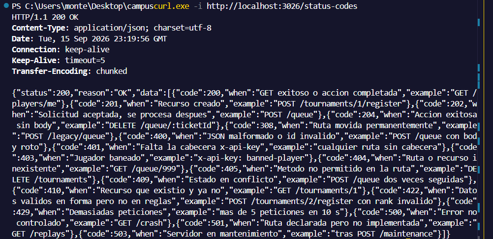

```curl -i http://localhost:3026/players/me```

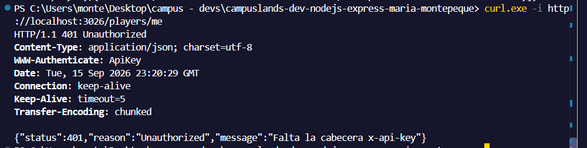

```curl -i http://localhost:3026/players/me -H "x-api-key: banned-player"```

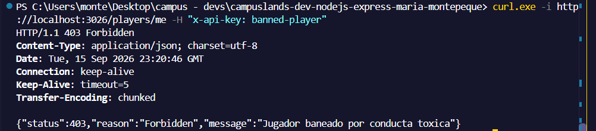

```curl -i http://localhost:3026/players/me -H "x-api-key: nova"```

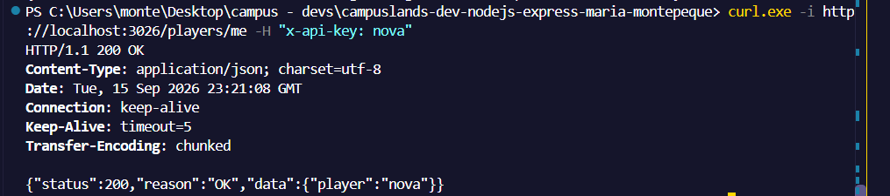

```curl -i -X POST http://localhost:3026/queue -H "x-api-key: nova" -H "Content-Type: application/json" -d '{"mode":"squad"}'```

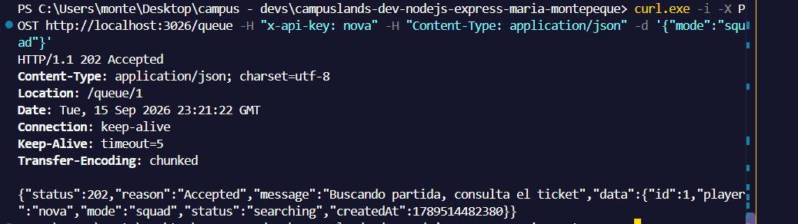

```curl -i -X POST http://localhost:3026/queue -H "x-api-key: nova" -H "Content-Type: application/json" -d '{"mode":"squad"}'```

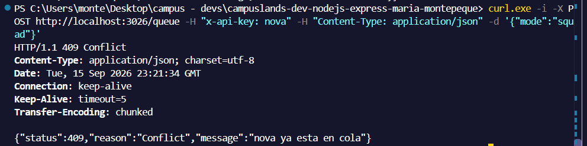

```curl -i -X POST http://localhost:3026/queue -H "x-api-key: nova" -H "Content-Type: application/json" -d '{"mode":"battle-royale"}'```

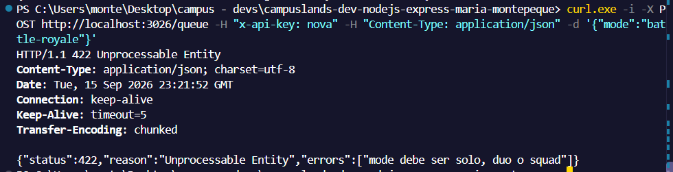

```curl -i http://localhost:3026/queue/1 -H "x-api-key: nova"```

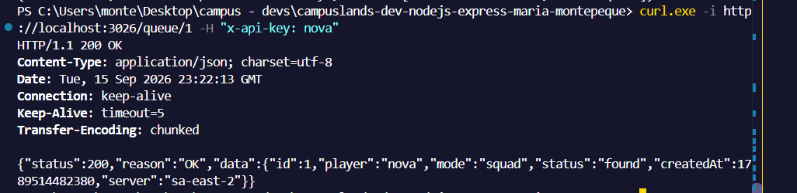

```curl -i -X POST http://localhost:3026/legacy/queue -H "x-api-key: nova"```

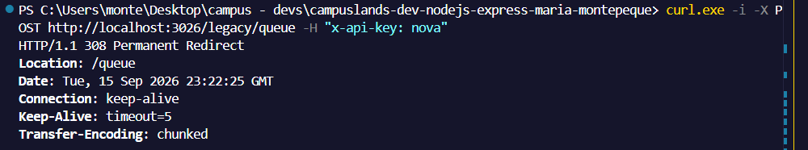

```curl -i -X DELETE http://localhost:3026/queue/1 -H "x-api-key: otro"```

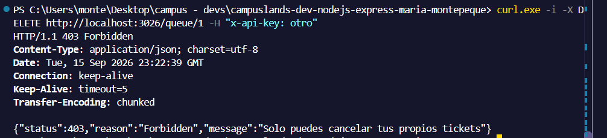

```curl -i -X DELETE http://localhost:3026/queue/1 -H "x-api-key: nova"```

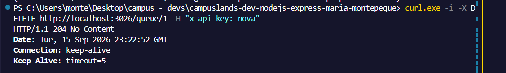

```curl -i http://localhost:3026/tournaments/1 -H "x-api-key: nova"```

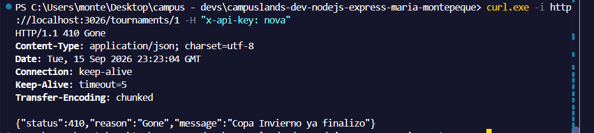

```curl -i -X POST http://localhost:3026/tournaments/2/register -H "x-api-key: nova" -H "Content-Type: application/json" -d '{"rank":"oro"}'```

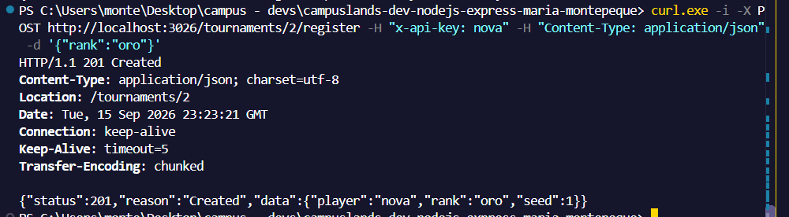

```curl -i -X DELETE http://localhost:3026/tournaments/2 -H "x-api-key: nova"```

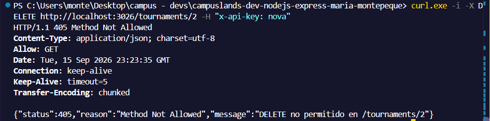

```curl -i http://localhost:3026/replays -H "x-api-key: nova"```

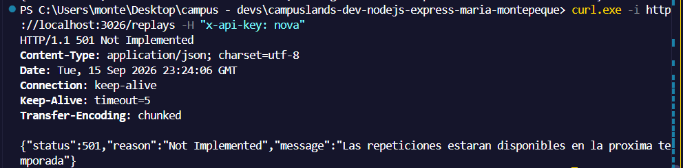

```curl -i http://localhost:3026/crash -H "x-api-key: nova"```

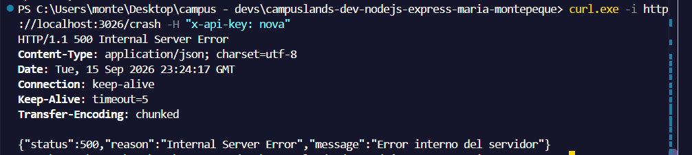

```curl -i -X POST http://localhost:3026/maintenance -H "x-api-key: nova" -H "Content-Type: application/json" -d '{"enabled":true}'```

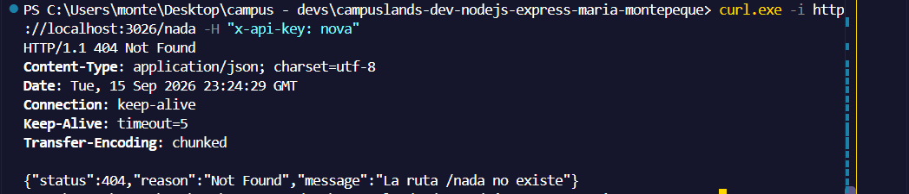

```curl -i http://localhost:3026/players/me -H "x-api-key: nova"```

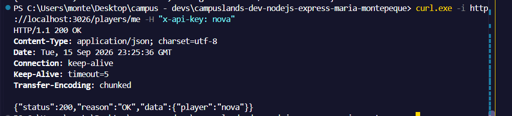
