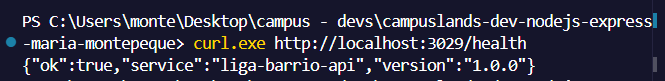
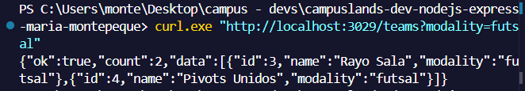
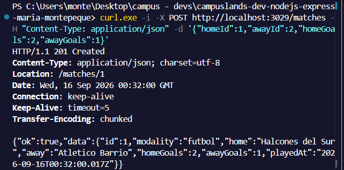
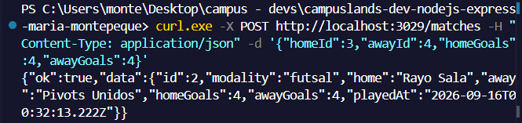
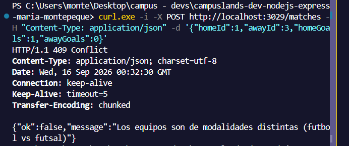
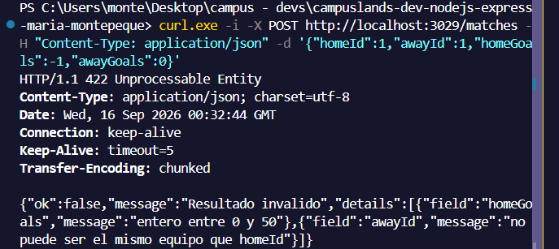
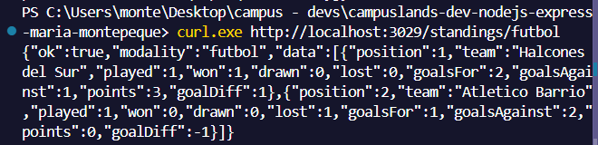
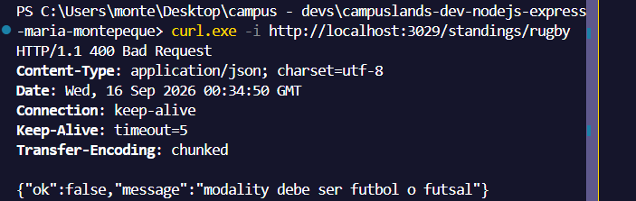
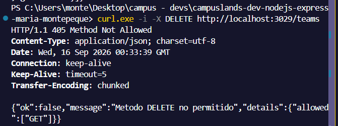

# Liga Barrio API

API REST de una liga amateur de **futbol** y **futbol sala (futsal)**: equipos,
resultados y tabla de posiciones calculada al vuelo. Construida con Node.js
nativo (`node:http`), sin dependencias.

Ejercicio 29 del nivel basico: el entregable es este README tecnico. El
codigo existe para que cada seccion se pueda verificar.

## Tabla de contenido

1. [Requisitos](#requisitos)
2. [Instalacion y ejecucion](#instalacion-y-ejecucion)
3. [Configuracion](#configuracion)
4. [Arquitectura](#arquitectura)
5. [Modelo de datos](#modelo-de-datos)
6. [Referencia de la API](#referencia-de-la-api)
7. [Errores](#errores)
8. [Pruebas](#pruebas)
9. [Decisiones tecnicas](#decisiones-tecnicas)
10. [Limitaciones y roadmap](#limitaciones-y-roadmap)
11. [Solucion de problemas](#solucion-de-problemas)
12. [Glosario](#glosario)

## Requisitos

| Herramienta | Version minima | Verificar con   |
| ----------- | -------------- | --------------- |
| Node.js     | 20.0           | `node --version` |
| npm         | 9.0            | `npm --version`  |
| curl        | cualquiera     | `curl --version` |

No requiere base de datos ni servicios externos.

## Instalacion y ejecucion

```bash
git clone <url-del-fork>
cd basico/ejercicio-29/resoluciones/maria-montepeque
npm install
npm start
```

| Script         | Que hace                                              |
| -------------- | ----------------------------------------------------- |
| `npm start`    | Levanta el servidor en `http://localhost:3029`        |
| `npm run dev`  | Igual, con recarga automatica (`node --watch`)        |
| `npm test`     | Ejecuta las pruebas unitarias del servicio con `node:test` |

Salida esperada al iniciar:

```text
Liga Barrio API escuchando en http://localhost:3029
```

## Configuracion

| Variable | Obligatoria | Default | Descripcion                    |
| -------- | ----------- | ------- | ------------------------------ |
| `PORT`   | No          | `3029`  | Puerto en el que escucha la API |

PowerShell: `$env:PORT=4000; npm start` · Bash: `PORT=4000 npm start`

## Arquitectura

```text
cliente (curl / REST Client / navegador)
   |
   v
src/server.js          crea el servidor http y escucha en PORT
   |
   v
src/app.js             resuelve la ruta, captura errores y responde JSON
   |
   v
src/routes/            declara metodo + path -> controlador
   |
   v
src/controllers/       lee params/query/body y elige el codigo HTTP
   |
   v
src/services/          reglas de negocio y datos en memoria (sin req/res)
```

```text
src/
├── server.js
├── app.js
├── core/http.js                    HttpError, json(), readJson(), createRouter()
├── routes/league.routes.js
├── controllers/league.controller.js
└── services/
    ├── league.service.js
    └── league.service.test.js
docs/
└── api.http                        coleccion de peticiones para REST Client
```

Flujo de una peticion `POST /matches`:

1. `app.js` busca la ruta; si no existe responde 404, si el metodo no aplica 405.
2. `league.controller.postMatch` lee el body con `readJson` (400 si no es JSON).
3. `league.service.recordMatch` valida goles (422), existencia de equipos (404)
   y que ambos sean de la misma modalidad (409).
4. El controlador responde 201 con `Location: /matches/:id`.

## Modelo de datos

**Team**

| Campo      | Tipo   | Descripcion                    |
| ---------- | ------ | ------------------------------ |
| `id`       | number | Identificador                  |
| `name`     | string | Nombre del equipo              |
| `modality` | string | `futbol` (11 vs 11) o `futsal` (5 vs 5) |

**Match**

| Campo       | Tipo   | Descripcion                        |
| ----------- | ------ | ---------------------------------- |
| `id`        | number | Identificador                      |
| `modality`  | string | Heredada de los equipos            |
| `home`/`away` | string | Nombres de los equipos           |
| `homeGoals`/`awayGoals` | number | Goles (0 a 50)          |
| `playedAt`  | string | Fecha ISO de registro              |

**StandingRow** (calculada, no se almacena)

`position`, `team`, `played`, `won`, `drawn`, `lost`, `goalsFor`,
`goalsAgainst`, `goalDiff`, `points`.

Reglas de puntuacion: victoria 3, empate 1, derrota 0. Desempate: diferencia
de gol, luego goles a favor, luego nombre.

## Referencia de la API

Base URL: `http://localhost:3029`. Todas las respuestas son JSON con
`ok: true|false`.

| Metodo | Ruta                    | Descripcion                        | Codigos            |
| ------ | ----------------------- | ---------------------------------- | ------------------ |
| GET    | `/health`               | Estado y version                   | 200                |
| GET    | `/modalities`           | Reglas de cada modalidad           | 200                |
| GET    | `/teams`                | Lista equipos (`?modality=futsal`) | 200, 400           |
| GET    | `/teams/:id`            | Un equipo                          | 200, 404           |
| GET    | `/matches`              | Resultados registrados             | 200                |
| POST   | `/matches`              | Registra un resultado              | 201, 400, 404, 409, 422 |
| GET    | `/standings/:modality`  | Tabla de posiciones                | 200, 400           |

### GET /teams?modality=futsal

```json
{
  "ok": true,
  "count": 2,
  "data": [
    { "id": 3, "name": "Rayo Sala", "modality": "futsal" },
    { "id": 4, "name": "Pivots Unidos", "modality": "futsal" }
  ]
}
```

### POST /matches

Request:

```http
POST /matches
Content-Type: application/json

{ "homeId": 1, "awayId": 2, "homeGoals": 2, "awayGoals": 1 }
```

Response `201` (`Location: /matches/1`):

```json
{
  "ok": true,
  "data": {
    "id": 1,
    "modality": "futbol",
    "home": "Halcones del Sur",
    "away": "Atletico Barrio",
    "homeGoals": 2,
    "awayGoals": 1,
    "playedAt": "2026-09-15T14:00:00.000Z"
  }
}
```

### GET /standings/futbol

```json
{
  "ok": true,
  "modality": "futbol",
  "data": [
    { "position": 1, "team": "Halcones del Sur", "played": 1, "won": 1, "drawn": 0, "lost": 0, "goalsFor": 2, "goalsAgainst": 1, "goalDiff": 1, "points": 3 },
    { "position": 2, "team": "Atletico Barrio", "played": 1, "won": 0, "drawn": 0, "lost": 1, "goalsFor": 1, "goalsAgainst": 2, "goalDiff": -1, "points": 0 }
  ]
}
```

## Errores

Formato unico:

```json
{ "ok": false, "message": "descripcion", "details": [ { "field": "homeGoals", "message": "entero entre 0 y 50" } ] }
```

`details` solo aparece en 422 y 405.

| Codigo | Cuando                                              | Ejemplo                                      |
| ------ | --------------------------------------------------- | -------------------------------------------- |
| 400    | Body no es JSON o `modality` desconocida            | `GET /teams?modality=rugby`                  |
| 404    | Ruta o equipo inexistente                           | `GET /teams/99`                              |
| 405    | Metodo no permitido (incluye `details.allowed`)     | `DELETE /teams`                              |
| 409    | Equipos de modalidades distintas                    | `homeId: 1` (futbol) vs `awayId: 3` (futsal) |
| 422    | Goles fuera de rango o mismo equipo en ambos lados  | `homeGoals: -1`                              |
| 500    | Error no controlado (se registra en consola)        | -                                            |

## Pruebas

Unitarias (no necesitan servidor):

```bash
npm test
```

Cubren: puntos por victoria, rechazo de modalidades cruzadas y detalle de
errores 422.

Manuales con curl:

```bash```

```curl http://localhost:3029/health```



```curl "http://localhost:3029/teams?modality=futsal"```



```curl -i -X POST http://localhost:3029/matches -H "Content-Type: application/json" -d '{"homeId":1,"awayId":2,"homeGoals":2,"awayGoals":1}'```



```curl -X POST http://localhost:3029/matches -H "Content-Type: application/json" -d '{"homeId":3,"awayId":4,"homeGoals":4,"awayGoals":4}'```



```curl -i -X POST http://localhost:3029/matches -H "Content-Type: application/json" -d '{"homeId":1,"awayId":3,"homeGoals":1,"awayGoals":0}'```



```curl -i -X POST http://localhost:3029/matches -H "Content-Type: application/json" -d '{"homeId":1,"awayId":1,"homeGoals":-1,"awayGoals":0}'```



```curl http://localhost:3029/standings/futbol```



```curl -i http://localhost:3029/standings/rugby```



```curl -i -X DELETE http://localhost:3029/teams```




Con la extension REST Client de VS Code: abre `docs/api.http` y usa
"Send Request" sobre cada bloque.

## Decisiones tecnicas

| Decision                            | Motivo                                                                 |
| ----------------------------------- | ---------------------------------------------------------------------- |
| `node:http` en lugar de Express     | Cero dependencias; el enrutador propio (`core/http.js`) tiene 40 lineas |
| Tabla calculada, no almacenada      | Evita inconsistencias: la fuente de verdad son los partidos            |
| `HttpError` con `status`            | Los servicios expresan el error de negocio y `app.js` lo traduce a HTTP |
| 422 para validacion, 409 para reglas de estado | Distingue "datos mal formados" de "datos validos pero incompatibles" |
| Datos en memoria                    | Alcance del ejercicio; ver roadmap                                     |

## Limitaciones y roadmap

- Los datos se pierden al reiniciar (memoria). Siguiente paso: persistir en
  un archivo JSON con `node:fs`.
- No hay autenticacion: cualquiera puede registrar resultados.
- No se pueden crear equipos por API (solo los 4 semilla).
- Sin paginacion en `/matches`.

## Solucion de problemas

| Sintoma                                          | Causa probable                         | Solucion                                   |
| ------------------------------------------------ | -------------------------------------- | ------------------------------------------ |
| `EADDRINUSE`                                     | El puerto 3029 esta ocupado            | Cambia `PORT` o cierra el otro proceso     |
| `curl: (7) Failed to connect`                    | El servidor no esta corriendo          | Ejecuta `npm start` en otra terminal       |
| `unmatched close brace` en PowerShell            | Comillas del JSON mal escapadas        | Envuelve el body en comillas simples       |
| `Cannot find module`                             | Se ejecuto desde otra carpeta          | Situate en la raiz de la entrega           |
| Respuesta 400 "El body no es JSON valido"        | Falta `Content-Type` o JSON roto       | Revisa la cabecera y el formato            |

## Glosario

- **Futsal**: futbol sala, 5 jugadores por equipo, dos tiempos de 20 min.
- **Modalidad**: variante del deporte (`futbol` o `futsal`); no se mezclan.
- **goalDiff**: goles a favor menos goles en contra.
- **Standing**: fila de la tabla de posiciones.
